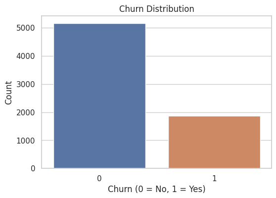
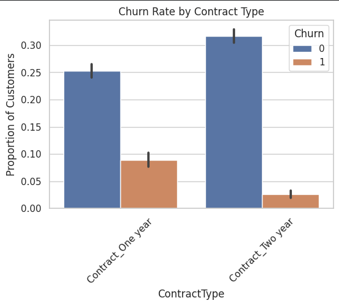
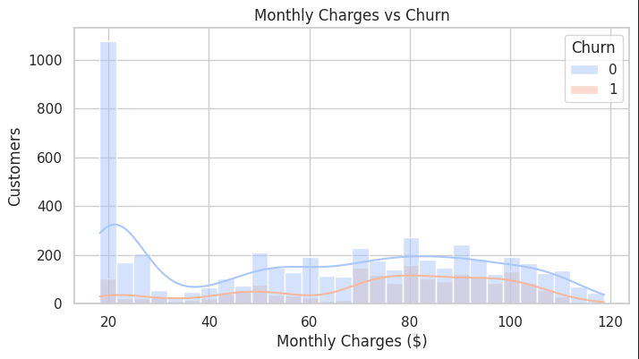
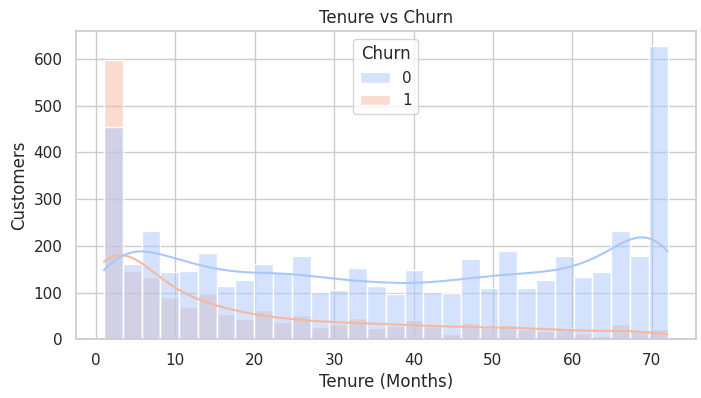
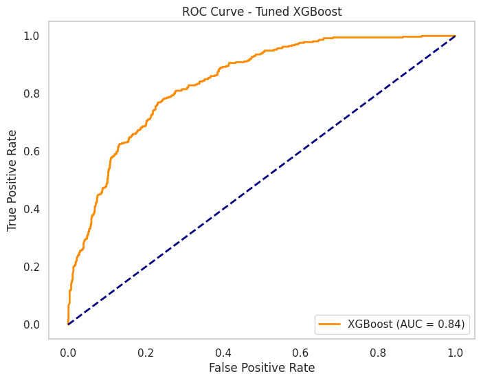
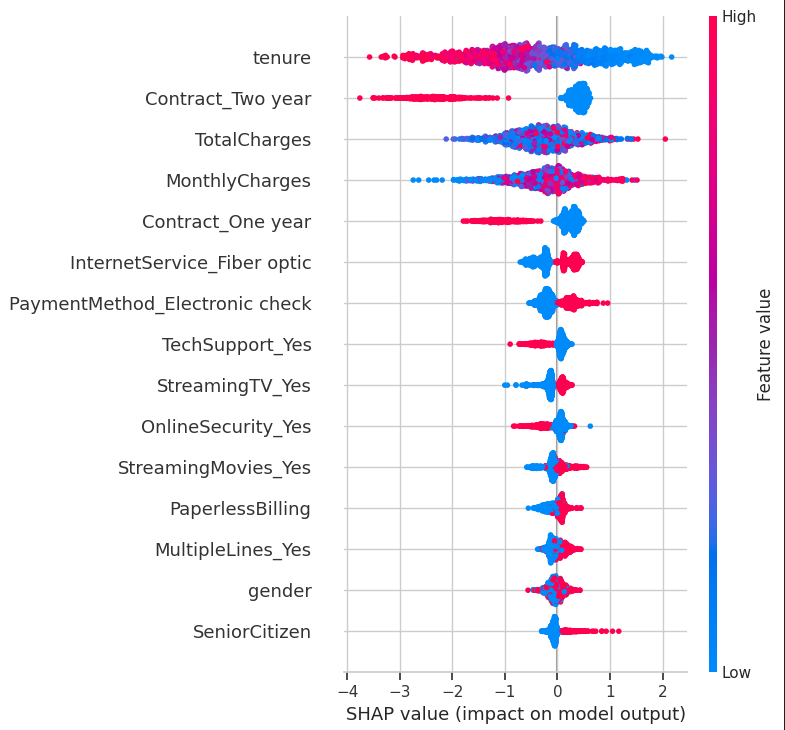
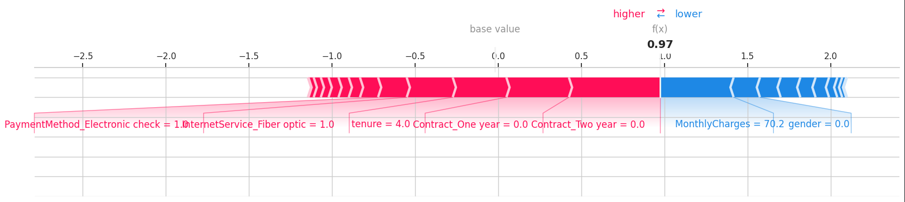

# 📉 Telco Customer Churn Prediction — FMCG & Retail Ready

> A production-grade **churn prediction solution** with clear storytelling, SHAP-based interpretability, and actionable business insights — built for fast-paced industries like **Retail & FMCG**.

---

## 🚀 Executive Summary

As a former analyst for **PepsiCo (via Genpact)** and coming from a strong retail business background, I understand how **churn analytics** can directly impact **operational costs, marketing efficiency, and customer lifetime value**.

This project simulates a telecom churn scenario — but the modeling logic, feature behavior, and churn drivers are equally relevant in **retail, e-commerce, and CPG** contexts, where:

- Tenure = Customer loyalty cycles
- Contract = Subscription plans or purchasing habits
- Charges = Discount sensitivity or price behavior

---

## 🧠 Business Problem

Customer churn is costly — and **retention is 5x cheaper than acquisition**. Predicting *who will churn* and *why* enables proactive campaigns, personalized outreach, and better resource allocation.

**Objective**:  
- Predict churn risk using ML models  
- Explain predictions to stakeholders using SHAP  
- Align with FMCG churn KPIs (repeat rate, tenure, high-risk customer tags)

---

## 📁 Dataset Overview

- **Source**: [Kaggle - Telco Customer Churn](https://www.kaggle.com/datasets/blastchar/telco-customer-churn)
- **Records**: 7,043
- **Target**: `Churn` (Yes/No)
- **Features**: Contract type, charges, payment mode, online services, tenure, etc.

---

## 📊 Exploratory Insights (EDA)

### 1. Churn Distribution

### 2. Churn Rate by Contract Type

### 3. Monthly Charges vs Churn

### 4. Tenure vs Churn

🧠 **Takeaways**:
- Monthly contract holders churn the most.
- Short-tenure users are at higher risk.
- High monthly charges correlate with churn.

---

## ⚙️ Tech Stack

| Category           | Tools / Frameworks                           |
|--------------------|----------------------------------------------|
| Language           | Python (Jupyter Notebook)                    |
| Data Processing    | pandas, numpy                                |
| Visualization      | seaborn, matplotlib, plotly                  |
| Modeling           | XGBoost, Random Forest, Logistic Regression  |
| Interpretability   | SHAP                                         |
| Deployment Ready   | `.pkl`, `.json` model artifacts              |

---

## 🤖 Modeling & Evaluation

We tested three models and selected **XGBoost** for its superior recall (key in churn problems).

| Model               | Recall (Churn) | ROC AUC |
|--------------------|----------------|---------|
| Logistic Regression| 0.72           | 0.84    |
| Random Forest       | 0.76           | 0.87    |
| **XGBoost (Final)** | **0.80**       | **0.89**|

### ROC Curve - XGBoost

---

## 🔍 Model Interpretability with SHAP

### SHAP Summary Plot

### Force Plot (Individual Customer)

📌 **Key Influential Features**:
- Contract type (Month-to-month is risky)
- Tenure (low = higher churn risk)
- Monthly charges
- Online security, tech support

---

## ✅ Deliverables

- ✅ Cleaned dataset with labeled variables
- ✅ XGBoost model (`.pkl`, `.json`) for easy deployment
- ✅ Model evaluation & metrics
- ✅ SHAP explanations for transparency
- ✅ 📄 [Full PDF Report](Telco_Customer_Churn_Report.pdf)

---

## 📚 Next Steps

- 🧪 Add cost-sensitive learning (e.g. Focal Loss)
- 📊 Streamlit dashboard with churn likelihood filters
- 📈 Integrate into a CRM for real-time flagging

---

## 🧠 Key Learnings

- 📌 **Recall matters more than accuracy** in churn prediction
- 💡 Feature engineering & preprocessing have major impact
- 🧭 Explainability tools like SHAP are game-changers for stakeholder trust

---

## 📬 Let’s Connect

I'm actively seeking **data analytics roles** in **Retail, FMCG, or Product Analytics**.

- 🔗 [LinkedIn](https://www.linkedin.com/in/abinashsahoo/)
- 🌐 [Portfolio](https://www.notion.so/Hey-there-I-am-Abinash-Sahoo-1dfe544fcbea80ef973eec9fd705f513)
- 📄 [Project PDF Report](Telco_Customer_Churn_Report.pdf)

---

## ⭐ Show Your Support

If you found this project helpful, please consider **⭐ starring** the repo and sharing feedback!

