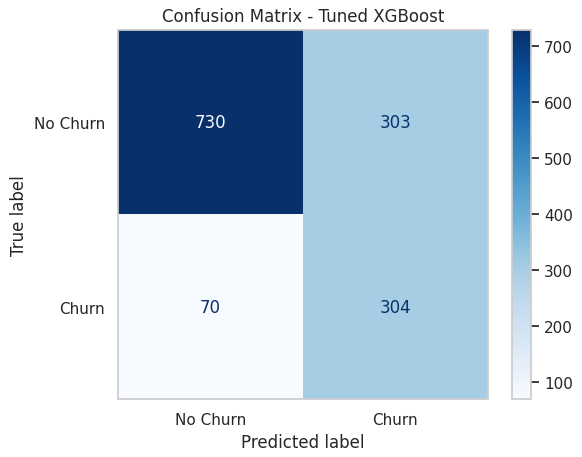
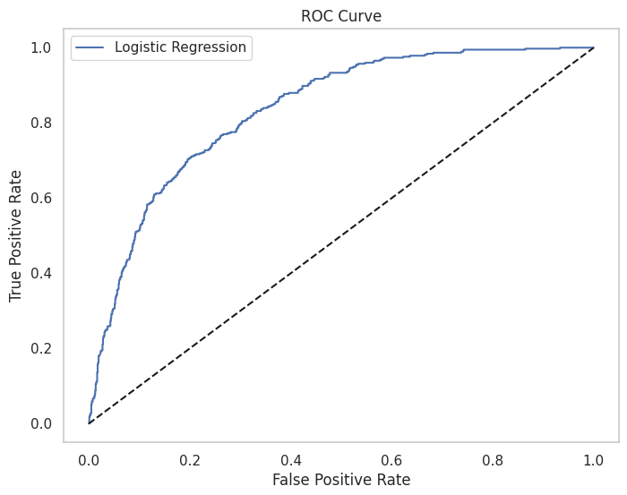
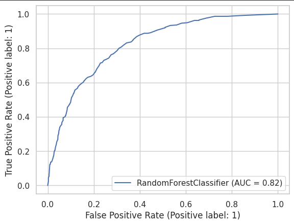
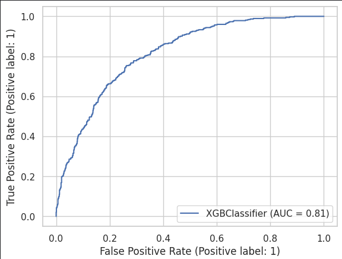
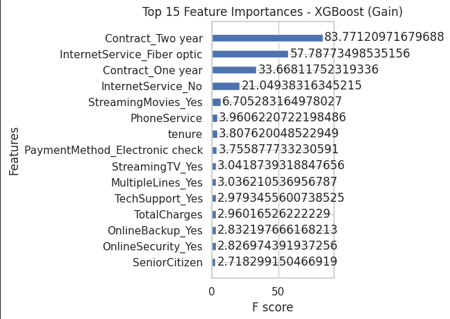

# 📉 Telco Customer Churn Prediction

An end-to-end machine learning project to predict customer churn using real-world telecom data. It applies advanced modeling (XGBoost, Logistic Regression, Random Forest), interpretability techniques (SHAP), and EDA to uncover churn patterns.

---

## 🚀 Project Highlights

- **Goal**: Predict customers likely to churn and understand key drivers behind churn.
- **Tech Stack**: Python, Pandas, scikit-learn, XGBoost, SHAP, Matplotlib, Seaborn
- **Dataset**: Telco Customer Churn dataset (Kaggle)
- **Modeling Focus**: Maximizing recall to capture churners
- **Model Interpretability**: SHAP value analysis for transparency
- **Key Deliverables**:
  - Model training & comparison
  - Visual EDA & feature analysis
  - SHAP-based interpretability
  - Confusion matrices, ROC curves, feature importance plots

---

## 📁 Folder Structure

Telco-Customer-Churn-Prediction/
│
├── images/ # All project visualizations (see below)
├── data/ # Cleaned dataset
├── notebooks/ # Jupyter notebooks for each phase
├── models/ # Saved model files
├── README.md # This file
└── requirements.txt # Dependencies

📸 *Project visuals folder preview:*

## 📊 Exploratory Data Analysis (EDA)

### 1. Churn Distribution

### 2. Churn Rate by Contract Type

### 3. Monthly Charges vs Churn

### 4. Tenure vs Churn

---

## 📈 Model Evaluation

### 1. Confusion Matrix - Tuned XGBoost

### 2. ROC Curve - Logistic Regression

### 3. ROC Curve - Random Forest

### 4. ROC Curve - Tuned XGBoost

### 5. ROC Curve - XGBoost Final

---

## 🧠 Feature Importance & SHAP

### 1. XGBoost Top 15 Feature Importances

### 2. TreeExplainer Global Importance

### 3. SHAP Summary Plot

### 4. SHAP Force Plot

---

## ✅ Key Learnings

- Importance of **recall** in churn problems
- Clear impact of **contract type** and **tenure**
- How **SHAP** values can build trust and transparency in predictions

---

## 📌 Next Steps

- 📉 Integrate cost-sensitive learning
- 📊 Deploy dashboard using **Streamlit**
- 🔁 Hyperparameter tuning via **Optuna**

---

## 📬 Let's Connect

- 🔗 [LinkedIn](https://www.linkedin.com/in/abinashsahoo/)
- 🔗 [Portfolio](https://www.notion.so/Hey-there-I-am-Abinash-Sahoo-1dfe544fcbea80ef973eec9fd705f513)
- 📫 Reach me for collaboration, feedback, or project walkthroughs!

---

